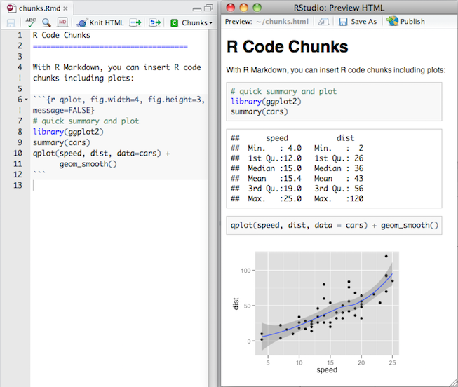

```{r setup, echo=FALSE}
knitr::opts_chunk$set(echo = TRUE)
```

# Introduction

## Outline

<div class="columns-2">
- What is R?
- What is RStudio?

**Specifics on R**:

- Basic R syntax
- Reading in data
- Creating plots
- Regression models
- Analysis of Variance

 **What next?**
 
 - Environmental analyses in R
 - The power of R + Markdown: easy formatting that can be re-used in the future
</div>

## Materials

- All source code at https://github.com/charlottehchang/RintroductionCEPF

- Slides at http://rpubs.com/chwchang/RintroCEPF

- This presentation borrows heavily from [Dr. Nicholas Matzke](http://phylo.wikidot.com/2014-summer-research-experiences-sre-at-nimbios-for-undergra) and [Dr. Mine Cetinkaya-Rundel](https://github.com/mine-cetinkaya-rundel/rworkshop-mem/blob/master/rworkshop-mem.Rmd)

# Introduction to R and RStudio

## What is R? {.smaller}

- **R\:** Statistical programming language
    - Objects belong to different *classes* (similar to object-oriented programming)
    - Common data classes include: `vector` (set of numbers or words), `matrix` or `data.frame` (similar to a spreadsheet: columns of vectors), `list` (usually a mixture of vectors, matrices, or other objects--one key feature is that they are not forced to be the same length)
    - Often, issues with analyses or errors are due to using the wrong type of input class for a function. 
    - The great strength of **R** and other open-source languages (e.g. **python**, **Julia**, **C**, **Fortran**) is that they are *free* and you can reproduce your analyses by simply re-running your code! 
    
## A manifesto for Open-Source Languages

- By embracing code, you free yourself from painful trips down memory lane to recall exactly which buttons you pressed to perform a specific task.
- "Open-source" means that you can inspect the code yourself and understand how and what functions are doing!
- R is especially well-suited for ecological statistical analyses (and increasingly more complex forms of modeling). There are TONS of packages (more than *10,000*) with easy installation. So pretty much any type of analysis you can think of, there is some way to do in R!

## What is RStudio?

- **RStudio\:** 
    - "Integrated development environment" (IDE) for R
        - The term IDE is a fancy way of saying that you can run code and see output within the same program.
    - Powerful, helpful, and **free** user interface for R
    - All of this is just another way of saying that RStudio is a software package where you can run the R programming language more easily.

## Accessing R and RStudio {.smaller}
<div class="columns-2">

- Software links
    - R: https://cran.r-project.org/
    - RStudio: https://www.rstudio.com/
    products/RStudio/#Desktop

- Resources for learning R:
    - [Hadley Wickham](http://r4ds.had.co.nz/)
    - [swirl](http://swirlstats.com/students.html)
    - [Data Carpentry](http://www.datacarpentry.org/R-ecology-lesson/index.html)
    - [Coursera](https://www.coursera.org/)
    - [DataCamp](https://www.datacamp.com/)
    - Many books and websites, such as [R-bloggers](https://www.r-bloggers.com/) and [Revolution Analytics](http://blog.revolutionanalytics.com/) as well as personal code repositories ([GitHub](github.com), [RPubs](RPubs.com), and more!)

<div>

- Debugging R errors:
    - "Debugging" means to remove bugs--deal with errors in your code
    - You can use the error to help you learn more and to fix the problem!
    - Often, searching on the internet with the error message will be helpful.
    - [StackOverflow](http://stackoverflow.com/) is a great website where people contribute questions and get answers.

## Anatomy of RStudio

<div class="columns-2">
- Left: Console
    - Text on top at launch: version of R that you’re running
    - Below that is the prompt
- Upper right: Workspace and command history
- Lower right: Plots, access to files, help, packages, data viewer


(from [rworkshop-mem](https://github.com/mine-cetinkaya-rundel/rworkshop-mem/tree/master/img))
</div>

## Key tips about R {.smaller}

- Version numbers are used to track changes to software, such as bug fixes and updates. For instance, `Windows 10` is a different version than `Windows XP`.

- When you open `R` or `RStudio`, the version number pops up in the Console (the area where code is run in `RStudio`; in `R`'s graphic user interface (GUI) the default screen is just the console).

- You can also run the command `R.Version()` or `R.version.string`

- To find out the version of RStudio go to Help $\rightarrow$ About RStudio

- It's good practice to keep both R and RStudio up to date
    - It can be painful to deal with re-installing R to update it, but there are good resources on how to deal with packages, such as [r-bloggers](https://www.r-bloggers.com/upgrade-r-without-losing-your-packages/). Note that if you update RStudio, you often have to update the R language version as well.

# Using R: Syntax and a general introduction

## Standard R syntax: Overview 

- Syntax refers to the rules that each programming language has about correctly defining functions, declaring variables, etc.
- Standard R syntax is similar but different to other major programming languages (especially `python` and `Julia`).
- Usually, you would be working with datasets (which are often matrices or `data.frame`s). 

## R syntax: Helpfiles

- One excellent feature of R is its `help` files. 
    + For any function, you can always use the command: `?` and then type in the function name.
    + The help page will tell you about the types of objects (classes) that it can accept, and what the function will produce.
    + For example:
    
```{r}
?plot # Tell me what plot does.
?mean # How does R calculate the mean of several values?
?glm # What is generalized linear modeling in R?
```

- Note that `#` means make a **comment** (text that is not interpreted as code). Comments are a great way to keep track of what you were doing in the past.

## Variables in `R`: vectors, matrices, and `data.frame`s {.smaller}

<div class="columns-2">
The most fundamental set of objects you will create in `R` are vectors, matrices, and `data.frame`s

```{r}
c(1:5) # A vector
matrix( rep(c(1:5), 3), nrow=3, byrow=T) # A matrix
data.frame(Site=c("A","B","C","D","E"), # A data frame
           MouseCount=rpois(5,10), 
           MuntjacCount=rpois(5,5),
           GaurCount=rpois(5,0.25))
```

- In `R`, you use `<-` or `=` ([but `<-` is better IMO](https://www.r-bloggers.com/difference-between-assignment-operators-in-r/)) to assign values to named variables, for example:
```{r}
days <- c(1:5) # make a variable named days 
               # and assign the values 1-5
days # show me days
```
</div>

## Matrices versus `data.frame`s

- Matrices and `data.frame`s are very similar--*except* that `data.frame`s can support multiple **classes** of objects.
    + That means that you can have one column be strings (`Site`) and the rest be numeric (`Count`).
- We can see this if we use the command for `matrix` on the `data.frame` that we created above:
```{r}
matrix( c( c("A","B","C","D","E"),
           MouseCount=rpois(5,10),
           MuntjacCount=rpois(5,5),
           GaurCount=rpois(5,0.25)), ncol=4)
# Everything is interpreted as a string and the counts are not numeric
```

## Workspaces {.smaller}

- A **workspace** is "your current R **working environment** and includes any user-defined objects (vectors, matrices, data frames, lists, functions) that you have entered. At the end of an R session, the user can save an image of the current workspace that is automatically reloaded the next time R is started." [Quick-R](https://www.statmethods.net/interface/workspace.html)

- For instace, we can see what is in my workspace right now using:

```{r, eval=F}
ls()
```

- We can also see what directory (file location or path) R is running out of.

```{r, eval=F}
getwd()
```

## Workspaces + Quitting

- Note that when you exit (or `quit`) R, it will always ask `Save workspace image`?
    + If you select `Save`, then everything that is in your current workspace (all the variables, analyses, etc.) will be stored and re-loaded when you re-open `R`.
    + Personally, I do not like to `Save` my workspace--I always want it to be empty so that I can control what I do and do not see in every session (a session is each instance where you open and run a program).
- For more information: [R-bloggers](https://www.r-bloggers.com/using-r-dont-save-your-workspace/) 

## Using `save` to preserve specific objects {.smaller}

- If you have specific objects (such as analyses or tables, or anything else) that you want to save to re-load later (and avoid re-running certain bits of code that might be slow or memory-intensive), you can use the command `save` or `save.image`.
- Example: I have a regression (`regression_mod`) that I want to save:
```{r, eval=F}
save(file="~/Rscripts/regression_mod.RData",regression_mod) 
# Unix (Linux/Mac) style path
```

- The alternative is to call `save.image` which would save *everything* in the current workspace. 
    + This is similar to the `Quit R Session: Save Workspace Image?` prompt, but better:
    + *You* control where the objects are located (file name)!
```{r, eval=F}
save.image(file="C:\Documents\MyWorkspace-5-26-2018.RData") # Windows-style path
```

- You can then re-load these objects into a new session with the commands:
```{r, eval=F}
load(file="C:\Documents\MyWorkspace-5-26-2018.RData")
```

## R packages {.smaller}

- "Packages are the *fundamental units of reproducible R code*. They include reusable R
functions, the documentation that describes how to use them, and (often) sample data."
(From [Hadley Wickham, a prominent R software developer with many helpful resources](http://r-pkgs.had.co.nz), emphasis mine.)

- R packages are stored online at the [Comprehensive R Archive Network](https://cran.r-project.org/) (CRAN), which currently has *12579* packages.

- The command `install.packages` lets you easily install any of the packages in CRAN.

```{r install-packages, eval=FALSE}
install.packages("gdata") # a package that specializes in dealing with excel spreadsheets
install.packages("ggplot2") # a popular package for plots that is an alternative to base R
```

- Note that you *only* have to install each package *once*!
    + It is like downloading a file or software: once it is on your machine, it's on your machine!

## Using R packages

- When you want to use a specific package, you *load* it by using the command `library`:
```{r load-packages, eval=F, message=FALSE}
library("gdata")
library("ggplot2")
```

- You must run the `library` command every time you want to use the functions from a specific package
    + or you can use the package name to call a specific function, but that is more advanced (e.g. `gdata::read.xls` - take the function to read excel files from `gdata` without me having to use the `library` call to load the whole package into the workspace)

## R syntax: `data.frame` example {.smaller}

Let's get on to an example of real-world data.

```{r, include=F}
set.seed(100)
xishuangbanna_birds_df <- data.frame(site = LETTERS,
                                     eco_cov = rnorm(mean=10, sd=5, n=26))

mean_birds <- c(0.75, 0.005, 0.5, 0.1)
xishuangbanna_birds_df[,3:6] <- matrix( unlist( lapply( mean_birds, function(x) {
  1 + rpois(26, x*xishuangbanna_birds_df$eco_cov)}) ),
  ncol=4)
names(xishuangbanna_birds_df)[3:6] <- c("Bulbul","Hornbill","TitBabbler","Babbler")
```


Here is a simulated (fake!) dataset entitled `xishuangbanna_birds_df` with bird counts and an ecological covariate (`eco_cov`).

```{r, echo=FALSE}
tibble::as_tibble(xishuangbanna_birds_df)
```

## R syntax: `data.frame` example

Let's say we wanted to extract observations for bulbuls. In traditional (often called *Base R*) R syntax, we would use the command:

```{r}
xishuangbanna_birds_df$Bulbul # Extracting a column from a dataset
```

If we wanted to see the first bulbul counts at the first five sites (A-E):

```{r}
xishuangbanna_birds_df$Bulbul[1:5] # Extracting values from vectors
```

## R syntax: `data.frame` example

To preview the data frame, you can use the command `str()`.

```{r}
str(xishuangbanna_birds_df)
```

## The "Tidyverse": a new style of R syntax

Some R users dislike the rules for extracting columns from datasets or values from vectors. 

They argue that it seems clunky and not that elegant.

There is an alternate "ecosystem" of packages called the Tidyverse (developed by [Hadley Wickham](http://r4ds.had.co.nz/introduction.html); the link contains excellent instruction materials). In the Tidyverse, you can perform standard R commands using a different set of rules.

## Tidyverse examples

To call the bulbul column, we can use this `tidyverse` command:

```{r, echo=F, message=FALSE}
library(tidyverse) # load the set of packages that constitute the tidyverse into your workspace
```

```{r, eval=F}
select(xishuangbanna_birds_df, Bulbul)
```

If we wanted to only see the sites where Bulbul observations were greater than 0:

```{r}
filter(xishuangbanna_birds_df, Bulbul > 0)
```

# Fundamental analyses in R 
**Reading in Data**

## Reading in data {.smaller}

- For the rest of this short course, we will continue with instruction focused on standard base `R` syntax (not `tidyverse` syntax).
- Oftentimes, you will want to import data from a spreadsheet. `read.csv` is perfect for Comma Separated Value (CSV) spreadsheets

```{r, eval=F}
read.csv(file="C:\Documents\FieldData.csv", header=T) 
  # Note that you have to specify the path (directory) where your file is located.
      # In this example, this would be a Windows-style path
  # header: do you have variable names for each column?
```

- The more general file read-in function is `read.table` which can take `.txt`, `.csv`, etc.

```{r, eval=F}
read.table(file="~/Documents/FieldData.csv",header=F)
  # In this example, the file directory is for a Unix (Linux/Mac OS) system
  # header=F means that I did not have names for the columns 
  # (no names for the variables), 
  # so they will be named X1, X2, X3, etc.
```

## Reading in data: Excel {.smaller}

- For Excel spreadsheets (\*.xls, \*.xlsx), the package `gdata` has a function to read in excel files that avoids common input issues.

```{r, eval=F}
install.packages("gdata") # recall that you only need to do this ONCE!
library("gdata") # you must do this every time 
                 # you start a new R session (re-open R)

## There are two ways to use the function read.xls from the gdata package:

    # 1: call it directly
read.xls(file="C:\Documents\FieldData.xlsx", sheet=1) 
# read.xls can only extract from one spreadsheet page at a time, 
# so tell it which page to look at

    # 2: tell R to go and look for the function "read.xls" from package "gdata":
gdata::read.xls(file="C:\Documents\FieldData.xlsx",sheet="Birds") 
# if your sheets have names, you can also refer to them by the names of each tab.
```

# Fundamental analyses in R 
**Basic math**

## Basic math in `R` {.smaller}

- You can use `R` to perform addition, subtraction, multiplication (including matrix multiplication), division, and pretty much any mathematical task you desire.
- Let's start by creating a variable `x` and assigning the value of `5` to it:

<div class="columns-2">
```{r}
x <- 5
x
x + 5
x / 5
x * 5
x - 5
```
</div>

## Basic math in `R` {.smaller}

<div class="columns-2">
- We can do the exact same sorts of things with vectors, matrices, and `data.frame`s. 
    + For instance, let's revisit `xishuangbanna_birds_df`
```{r}
# Find the total number of babblers in each site
xishuangbanna_birds_df$TitBabbler + xishuangbanna_birds_df$Babbler
```

- We could also define a vector and multiply it by another vector or matrix:
```{r}
tree_area <- rnorm(mean = 20, sd=3, n=5)
  # stand area of trees simulated from a normal distribution
tree_carbon <- rnorm(mean = 50, sd=5, n=5)
  # carbon per unit area simulated from a normal distribution
tree_area %*% tree_carbon

tree_sites_no <- matrix(rnorm(mean = 20, sd= 3, n=25), ncol = 5, nrow = 5)
tree_sites_no 
tree_sites_no %*% tree_carbon
```
</div>

# Fundamental analyses in `R`
**Statistics**

## Calculating descriptive statistics in `R` {.smaller}

- `R` has many standard functions for descriptive statistics, for example:

<div class="columns-2">
```{r}
mean(xishuangbanna_birds_df$Hornbill)
sd(xishuangbanna_birds_df$Hornbill) 
median(xishuangbanna_birds_df$Hornbill)
summary(xishuangbanna_birds_df$Hornbill)
```
</div>

- Sometimes, you may have missing values. These are known as `na`s. To deal with them, you can use `na.rm=T`: take out any missing values from my data before you do the analysis

<div class="columns-2">
```{r}
# Sample 10 observations from a poisson distribution
spotty_data <- rpois(8, 10)
# Remove the 5th observation and replace with NA
spotty_data[5] <- NA
mean(spotty_data) # uh-oh!
mean(spotty_data,na.rm=T) # phew!
```
</div>

## Visualizing data: Basic plots {.smaller}

- In Base `R`, you can use the command `plot` to create scatterplots, boxplots, histograms, barplots, and many other types of plots!
- The package `ggplot2` further extends the plotting capability of `R`
```{r, fig.width=8, fig.height=3}
par(mfcol=c(1,3), oma=c(0,0,0,0))
plot(cars,xlab="Speed",ylab="Distance",main="Cars Dataset Scatterplot", pch=19, col="grey60")
boxplot(count ~ spray, data = InsectSprays, col = "lightgray",xlab="Treatment",ylab="Insect Count", main="Insect Sprays Dataset")
hist(islands,xlab=expression(paste("Land area (miles"^2,")")))
```

## Analysis of Variance (ANOVA) {.smaller}

```{r, echo=F}
par(mar=c(1,4,4,1),oma=c(0,0,0,0))
```

<div class="columns-2">
- Oftentimes, we may be interested in how a continuous variable relates to a categorical variable
- One example is the dataset `PlantGrowth` which describes plant weight as a function of **control (ctrl)** or **experimental (trt1, trt2)** treatment.
```{r, fig.width=5}
# call the built-in "PlantGrowth" dataset
data("PlantGrowth") 
# ANOVA
anova(lm(weight ~ group, data = PlantGrowth))
# Boxplot
boxplot(weight ~ group, data = PlantGrowth, 
        main = "Plant Growth data",
        ylab = "Dried weight of plants", 
        xlab="Treatment", col = "lightgray")
```
</div>

## Regressions: Ordinary least squares (OLS) {.smaller}

- It is straightforward to build regression models (how does `y` (dependent variable) relate to `x` (predictors/independent variables)?)
    + [More regression examples here](http://r-statistics.co/Linear-Regression.html#Example%20Problem)
- As an example, let's regress braking distance against car speed using the `cars` dataset (`?cars`):

<div class="columns-2">
```{r}
data(cars)
# build linear regression model on full cars dataset
# and store in a variable named linearMod
linearMod <- lm(dist ~ speed, data=cars)  
linearMod # show me linearMod
# What was the model fit?
summary(linearMod)
```
</div>

## Generalized linear models (GLMs) {.smaller}

<div class="columns-2">
- The standard regression formula takes the form: $Y = \beta_0 + \beta_1 X_1 + \beta_2 X_2 + \dots + \varepsilon$.
- GLMs are multivariate regression models that go beyond OLS:
    + OLS assumes that the error term, $\varepsilon$ (unexplained variation) comes from a Normal distribution (note: this does not place assumptions on $Y$!)
- On the other hand, GLMs can accomodate many other distribution families, such as the types of error that would arise for count data (Poisson distributed) or binomial data (binary "yes" or "no" responses)
- For example, in the `xishuangbanna_birds_df` dataset, the bird counts clearly come from a Poisson distribution.
```{r}
summary(glm(Bulbul~eco_cov, data=xishuangbanna_birds_df, family=poisson))
```
</div>

# Environmental analyses in `R`

## `R`: spatial statistics {.smaller}

```{r, echo=F}
load("ChinaGGmap.rda")
```

<div class="columns-2">
- There is a growing and exciting set of tools in `R` to do complex geographical data cleaning, coordinate projection, and spatial manipulation.
- Arguably, a major advantage of using `R` and its spatial packages (e.g. `sp`, `rgeos`, `rgdal`, `raster`, `ggmap`, `sf`, and more) over GIS is that you can easily replicate your work in the future by simply re-executing your code!
```{r, message=F, fig.width=5}
ggmap::ggmap(China)
```

- More resources: [rspatial](http://www.rspatial.org/), [geocomputation](https://geocompr.robinlovelace.net/), [spatial.ly](http://spatial.ly/r/)
</div>

## Conservation social science {.smaller}

<div class="columns-2">
- As ecologists and conservationists, we often strive to understand what drives people to follow rules that protect natural resources.
- More importantly, we want to identify what leads to rule-breaking, such as: illegal hunting, logging, fishing, or other forms of resource exploitation.
- One problem is that asking questions about these activities directly can be uncomfortable for respondents, so they may lie to avoid telling the truth.
- We can deal with these issues by adopting indirect surveys, but then we need specialized methods to analyze the data (which are both binary--"yes" or "no"--and also cannot be taken at face value)
- [Charlotte Chang](https://github.com/charlottehchang/zapstRR) and [others](https://cran.r-project.org/web/packages/rr/index.html) have built packages for sensitive surveys in conservation.
```{r, echo=F, message=F}
library(zapstRR)
## Loading XSBN data
data("huntRRdata") # Load dataset from package

## Case study RRT design parameters
p00 <- p11 <- 5/6 # Forced response
  ## Forced response
fr.pi.table <- rbind(RRunivariate(y=huntRRdata['Barbet'], p00=p00, p11=p11)$estimates, # Barbet
                      RRunivariate(y=huntRRdata['Bulbul'], p00=p00, p11=p11)$estimates, # Bulbul
                      RRunivariate(y=huntRRdata['Partridge'], p00=p00, p11=p11)$estimates) # Partridge

fr.pi.table <- data.frame(fr.pi.table)
fr.pi.table$bird <- c("Barbet","Bulbul","Partridge")
```
```{r, echo=F, fig.width=5}
## Plotting
F1 <- ggplot(fr.pi.table, aes(x=bird, y=est))
F1 <- F1 + geom_point(position=position_dodge(width=0.5), size=2.5) + geom_errorbar(aes(ymin=min95,ymax=max95),position=position_dodge(width=0.5),width=0.25,size=0.3) + geom_hline(yintercept=0, linetype="dashed")
F1 <- F1 + labs(x="", y=expression(paste("Prevalence of hunting (",hat(pi)[1],")")), title="Bird hunting prevalence in XSBN") + coord_cartesian(ylim=c(-0.01,0.5)) + 
    theme_classic() +
    theme(text=element_text(size=14),axis.text.x  = element_text(size=14, color="black"), axis.text.y = element_text(size=13, color="black"))
F1
```
</div>

## Bayesian inference {.smaller}

- Bayesian approaches can be particularly helpful when you are dealing with data that come from a complex, hierarchical generative process.
- Take bird survey data as an example.
- In bird surveys, we face multiple problems:
    + A species might be present, but we may fail to detect it.
    + Certain species may be harder to detect at some times of the day or year.
    + Habitat quality can affect both the abundance of species and their detectability (e.g. how much are they singing, how active are they)?
- Bayesian models can allow us to specify the set of interactions leading to changes in detectability and abundance.
- There are *many* helpful resources on Bayesian methods in `R`:
    + [Gelman's Bayesian Data Analysis](http://www.stat.columbia.edu/~gelman/book/)
    + [Statistical Rethinking](http://xcelab.net/rm/statistical-rethinking/)
    + [Kery and Royle](https://www.mbr-pwrc.usgs.gov/pubanalysis/keryroylebook/)
    
# R Markdown: A way to make your code easy to share and easy to revisit! 

## What is (R) Markdown? {.smaller}

- Markdown is a straightforward language for turning plain text into nicely formatted HTML or PDF, which is a great format for sharing with collaborators.

- R Markdown combines the syntax (language rules) of markdown with embedded R code chunks that are run so their output can be included in the final document.

- R Markdown lets you create documents (you could even write an entire scientifc manuscript in R Markdown!), presentations (this presentation is written in R Markdown), and reports from R. 

- R Markdown documents are fully **reproducible** (they can be automatically regenerated whenever underlying R code or data changes). This is a **huge** advantage over a static workflow such as Microsoft Word + SPSS. Whenever you want to re-run your analyses, simply alter your code (usually just some small part of your code)--this is much easier than having to go back into something like SPSS or SAS and re-do all of the manual data input and analyses.

Source: http://rmarkdown.rstudio.com/ and https://github.com/mine-cetinkaya-rundel/rworkshop-mem/

## How do you create an R Markdown document? {.smaller}

In `RStudio`, you can create R Markdown documents, "knit" it (render the code into a nice format such as HTML or PDF), and examine the source code and the output.

1. File $\rightarrow$ R Markdown...

2. Enter a title (e.g. "Spatial analysis of predators and prey") and author info

3. Choose Document as file type, and HTML as the output

4. Hit OK

5. Click Knit HTML in the new document, which will prompt you to save your document
    - Naming tip: Do not use spaces
        - Instead, use "CaMeLcAsE" or underscores ("Camel_Case").
    - Viewing tip: Click on the down arrow next to Knit HTML and select View in Pane
    
## Markdown basics {.smaller}

- Markdown is a very simple formatting language based on 
plain text (the standard text format used in emails, at least historically) 

- Rather than writing complex code (e.g. HTML), Markdown enables the use 
of a syntax much more like plain-text email. 



## R Code Chunks {.smaller}

Within an R Markdown file, R Code Chunks can be embedded using the native Markdown syntax 
for fenced code regions.


# Thank you!
If you have any questions, please talk to Mingxia, or feel free to email Charlotte.

The slides are [online](http://rpubs.com/chwchang/RintroCEPF)